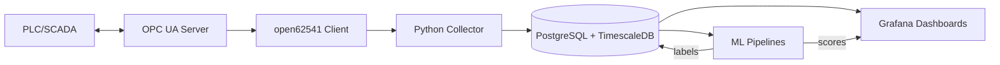

# OPC UA Сервер — генератор телеметрии с аномалиями

Этот пример использует **open62541** для создания OPC UA сервера, моделирующего
три технологических параметра с синусоидальными колебаниями, шумом и редкими аномальными выбросами.

## Параметры
1. **Bearing_Vibration_mm_s** — вибрация подшипника, мм/с.
2. **Temperature_C** — температура, °C.
3. **Pressure_bar** — давление, бар.
4. **Bearing_Alarm** — логический флаг тревоги (true при вибрации ≥ 7 мм/с).

## Особенности
- Обновление значений каждые 100 мс (10 Гц).
- Параметры доступны для чтения и записи (кроме Bearing_Alarm).
- Генерация сигналов с использованием синусов, случайного шума и редких аномалий.
- Пороговая тревога по вибрации.

## Сборка
```bash
gcc opcua_gen_pro.c -lopen62541 -lm -o opcua_gen_pro

## Сбор данных в PostgreSQL

Для записи метрик, генерируемых сервером `dynamic4.c`, используется Python‑скрипт `reader4.py`.

### Описание
Скрипт подключается к OPC UA серверу и считывает параметры:
- Bearing_Vibration_mm_s
- Temperature_C
- Pressure_bar
- Bearing_Alarm

Затем он записывает данные в таблицу `public.sensor_data2` в PostgreSQL с меткой времени.

### Структура таблицы
```sql
CREATE TABLE public.sensor_data2 (
    ts TIMESTAMPTZ NOT NULL,
    vibration DOUBLE PRECISION,
    temperature DOUBLE PRECISION,
    pressure DOUBLE PRECISION,
    vibration_alarm BOOLEAN
);

